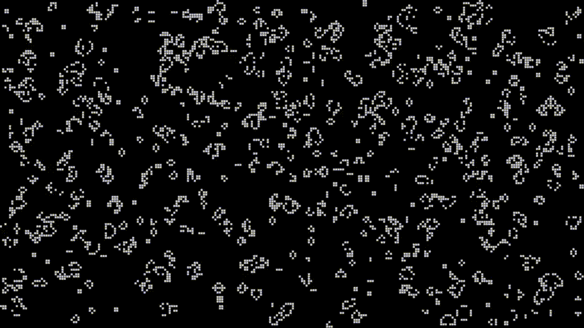

# Conway's Game Of Life
## Description
Conway's game of life implemented using C++ and raylib library.
## Technologies Used
- C++
- Raylib
- Cmake
## Installation & Running
1. **Clone the repository**
      ```sh
   git clone https://github.com/pmadzia/conway-game-of-life.git
   cd conway-game-of-life
      ```
3. **Build using Cmake**
      ```sh
   mkdir build
   cd build
   cmake ..
      ```
   **Examples**
   
- For VS 2022
      ```sh
   mkdir build
   cd build
   cmake -G "Visual Studio 17 2022" ..
      ```
- For MinGW
      ```sh
   mkdir build
   cd build
   cmake -G "MinGW Makefiles" ..
      ```
## Controls
- Spacebar - Pause the game
- G - toggle on/off grid
  
**When paused**
- R - restart the game
- Q - clear the screen
- LMB - to draw cells

## Demo

